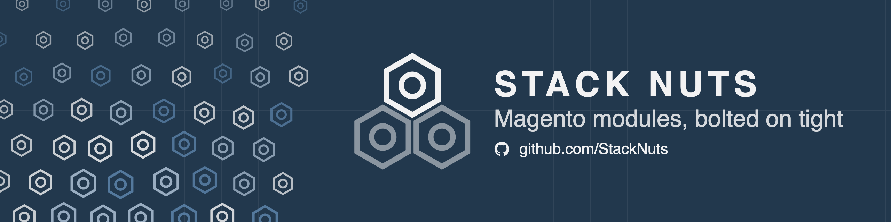

  

  <a href="https://stacknuts.co.uk">stacknuts.co.uk</a> ·
  <a href="https://packagist.org/packages/stacknuts">Packagist</a> ·
  <a href="https://github.com/sponsors/PhilRowe">Sponsor us</a>

## About StackNuts

  

StackNuts is a small collection of open source Magento 2 modules, built and maintained by an **Adobe Certified Professional – Adobe Commerce Developer** ([verify credential](https://certification.adobe.com/credential/verify/1bbb544f-90e2-11f1-bdd6-42010a400002)). Every module here grows out of more than 14 years of experience building custom functionality for Magento 2, refined and released to help other developers solve the same challenges.

No bloat, no unnecessary dependencies — just modules that do one job well and bolt on tight.

## Modules

📌 *Pinned below — see each repo for full docs and installation instructions.*

| Module | Description |
|---|---|
| [magento-cloudflare-cache](https://github.com/stacknuts/magento-cloudflare-cache) | Integrates Magento's cache invalidation with Cloudflare, so edge cache clears in step with Magento's own cache flushes. |
| [magento-sort-rules](https://github.com/stacknuts/magento-sort-rules) | Adds configurable, rule-based product sorting to Magento category pages, beyond the built-in sort options. |
| [magento-csp-debug](https://github.com/stacknuts/magento-csp-debug) | Makes Magento's Content Security Policy violations actually debuggable — surfaces what's being blocked and why, instead of leaving you guessing. |

All modules are available via [Packagist](https://packagist.org/packages/stacknuts) and installable with Composer.

## Sponsor

If a module has saved you time, consider [sponsoring PhilRowe](https://github.com/sponsors/PhilRowe) or [buying me a coffee](https://buymeacoffee.com/philrowe) — it helps keep these maintained and new ones coming.

## Get in touch

Found a bug, got an idea, or just want to say thanks? Open an issue on the relevant repo, or reach out via [stacknuts.co.uk](https://stacknuts.co.uk).